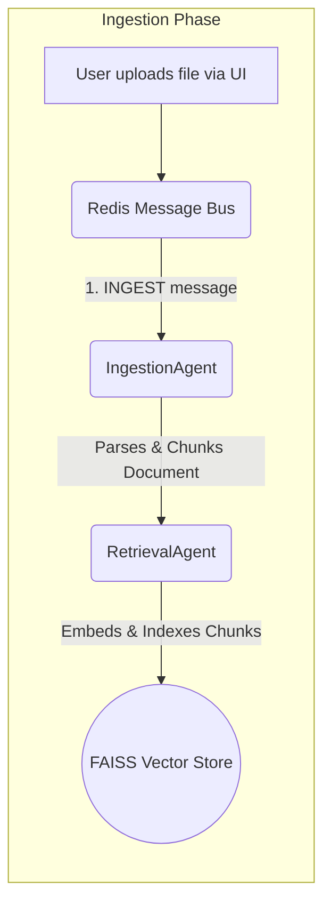
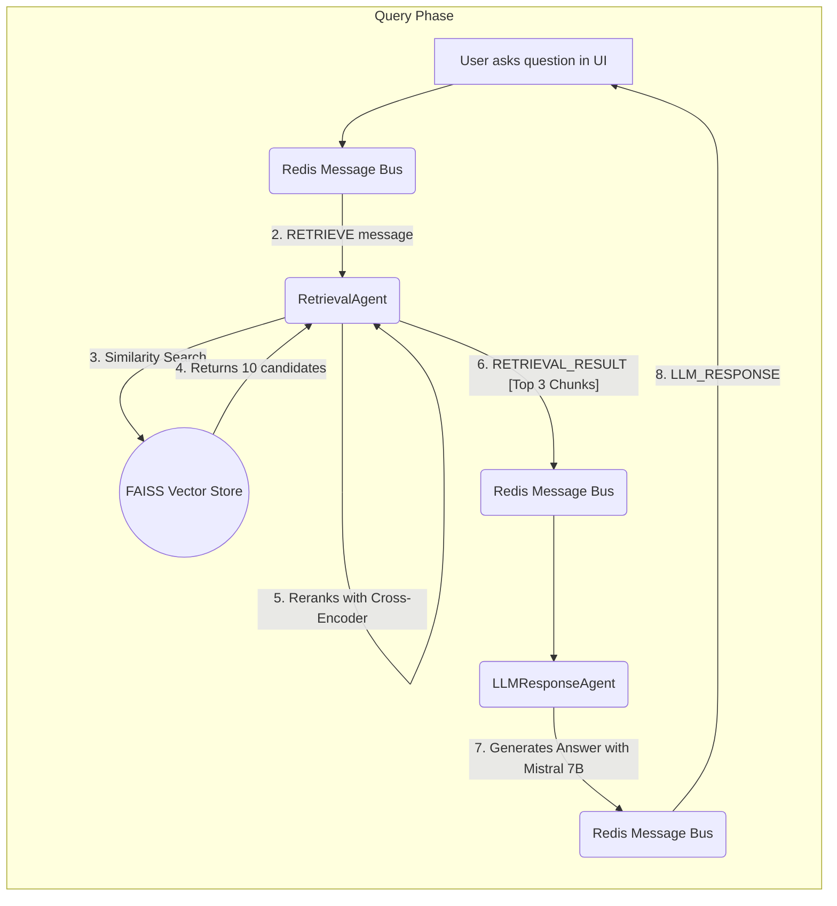

# Advanced Agentic RAG Chatbot

This project implements a sophisticated, agent-based Retrieval-Augmented Generation (RAG) chatbot capable of answering complex questions from a knowledge base of multiple document types. The architecture is built on a scalable Model Context Protocol (MCP) using Redis and features an advanced two-stage retrieval pipeline to ensure high-accuracy, contextually relevant answers powered by the state-of-the-art **Mistral-7B** model.

### Demo Video & Presentation

*   **[Link to Your 5-Minute Video Presentation]**
*   **[Link to the Architecture Presentation PDF in this Repo]**

---

## Architecture and System Flow

The system uses a decoupled, agentic architecture where specialized agents communicate asynchronously via a Redis message bus. This design ensures scalability, modularity, and maintainability.

The workflow is divided into two main phases: **Document Ingestion** and **Query & Response**.

### 1. Document Ingestion Flow



### 2. Query & Response Flow


### Detailed Workflow Steps:

1.  **UI & Ingestion Trigger (Streamlit)**: The user interacts with a Streamlit-based web UI to upload documents. For each new file, an `INGEST` message is dispatched to the Redis queue.

2.  **Agent 1: IngestionAgent (Document Processing)**: This agent consumes `INGEST` messages, uses LangChain's document loaders to read file content, and employs a `RecursiveCharacterTextSplitter` to break the text into smaller, overlapping chunks.

3.  **Agent 2: RetrievalAgent (Indexing)**: This agent consumes `ADD_DOCUMENT` messages. Using the `all-MiniLM-L6-v2` embedding model, it converts each chunk into a vector and stores it in a **FAISS** vector database.

4.  **User Query & Retrieval**: The user's question triggers a `RETRIEVE` message. The RetrievalAgent begins a two-stage retrieval process:
    *   **Stage 1: Vector Search (Recall)**: A fast FAISS search retrieves the top 10 potential chunks.
    *   **Stage 2: Cross-Encoder Reranking (Precision)**: The `ms-marco-MiniLM-L-6-v2` model reranks these 10 chunks to find the top 3 with the highest semantic relevance to the query. This step is critical for context quality.

5.  **Agent 3: LLMResponseAgent (Answer Generation)**: This agent receives the curated context. It uses a sophisticated prompt template to instruct the **Mistral-7B** LLM to generate a coherent, high-quality answer based strictly on the provided information.

---

## Model Selection and Rationale

The selection of AI models was an iterative process focused on achieving the highest quality answers while maintaining practical resource usage.

| Component          | Final Model Selected                    | Other Models Considered                   | Rationale for Final Choice                                                                                                                                                             |
| ------------------ | --------------------------------------- | ----------------------------------------- | ------------------------------------------------------------------------------------------------------------------------------------------------------------------------------------------------------ |
| **Embedding**      | `all-MiniLM-L6-v2`                        | N/A                                       | An industry standard chosen for its excellent balance of speed, size, and high performance in semantic search tasks.                                                                                 |
| **Reranking**      | `ms-marco-MiniLM-L-6-v2`                  | N/A                                       | A crucial design decision to boost retrieval accuracy. This Cross-Encoder model ensures the context sent to the LLM is as clean and relevant as possible.                                         |
| **Generative LLM** | `TheBloke/Mistral-7B-Instruct-v0.2-GGUF`  | `google/flan-t5-base`, `stablelm-zephyr-3b` | **`Flan-T5`** was too basic for complex reasoning. **`Zephyr-3B`** was a good step up. However, the goal was to use the SOTA **`Mistral-7B`** model. Its full size (~15 GB) is impractical for local review. **Solution**: Use a **GGUF-quantized** version, which provides the power of the Mistral-7B architecture in a CPU-friendly, ~4.4 GB package, demonstrating an understanding of practical deployment constraints. |

---

## Tech Stack Deep Dive

| Component               | Technology                                | Detailed Reason for Choice                                           |
| ----------------------- | ----------------------------------------- | ---------------------------------------------------------------------- |
| **UI Framework**        | Streamlit                                 | Enables rapid, Python-native development of interactive AI applications. |
| **Agent Communication**   | Redis (Pub/Sub)                           | Provides a scalable and robust message bus, decoupling agents into independent microservices. |
| **LLM Orchestration**   | LangChain & CTransformers               | LangChain for document processing and `ctransformers` for efficiently running GGUF-quantized models. |
| **Vector Database**     | FAISS                                     | Highly efficient in-memory similarity search for a responsive user experience. |

---

## Setup & How to Run

**Prerequisites:**
- Python 3.9+
- Redis Server (most easily run with Docker)
- Git

**1. Clone the repository:**
```bash
git clone [Your-GitHub-Repo-Link]
cd agentic-rag-project
```

**2. Create and activate a Python virtual environment:**
```bash
# On Windows
python -m venv venv
venv\Scripts\activate

# On macOS/Linux
python3 -m venv venv
source venv/bin/activate
```

**3. Install dependencies from the requirements file:**
*This includes `ctransformers` and `langchain-huggingface` for running the GGUF model.*
```bash
pip install -r requirements.txt
```

**4. Start the Redis Server in the background:**
```bash
docker run -d --name rag-redis -p 6379:6379 redis
```

**5. Run the Streamlit Application:**
*Note: The Mistral-7B GGUF model (~4.4 GB) will be downloaded automatically on the first run and cached in the `models/` directory.*
```bash
streamlit run app.py
```
The application will become available in your web browser, typically at `http://localhost:8501`.
